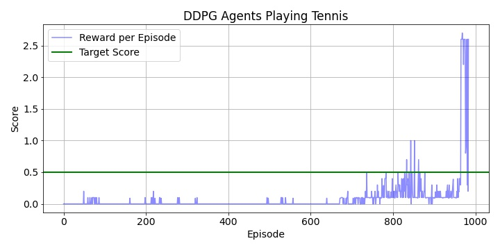

<center><h1>Udacity - DRLND</h1></center>
<center><h2>Project 3: Collaboration and Competition</h2></center>
<center><h3>Report by Siddhant Tandon</h3></center>
<center><h4>Date: 22 July 2020</h4></center>

### Environment
For this project the Unity ML Environment, [Tennis](https://github.com/Unity-Technologies/ml-agents/blob/master/docs/Learning-Environment-Examples.md#tennis), is used to train two agents to play tennis.

The agents control rackets to bounce a ball over the net. Agents receive +0.1 reward if they manages to hit ball over the net without dropping or hitting out of bounds. For dropping or hitting out of bounds, a penalty of -0.01 is issued.

The observation space consists of 24 variables representing position and velocity of the ball and racket. The actions space defines movement towards or away from the net, and jumping. The action vector (contains two numbers) is a number between 1 and -1.

Similar to previous projects, the Unity environment contains a brain that decides the actions of the agents. Given below are the characteristics of the agents and the environment:

1. Continuous observation space
2. Observation space size is 8 per agent
3. Three stacked vector observations
4. Action space vector is continuous
5. Action space size per agent is 2

The environment is deemed solved if the agents get an average score of +0.5 over 100 consecutive episodes.

### Algorithm

DDPG is an Actor-Critic method that uses value function and direct policy approximation at the same time.
There are two internal types of neural networks:
- Actor network - transforms state to action values. In this environment there are 4 action values. Check `model.py` line [19](./model.py#L19) for implementation. 

  ```
  self.fc1 = nn.Linear(state_size, 128)
    self.bn1 = nn.BatchNorm1d(128)
    self.fc2 = nn.Linear(128, 64)
    self.bn2 = nn.BatchNorm1d(64)
    self.fc3 = nn.Linear(64, 2)
    self.bn3 = nn.BatchNorm1d(2)

    x = self.fc1(state)
    x = F.relu(x)
    x = self.bn1(x)
    x = self.fc2(x)
    x = F.relu(x)
    x = self.bn2(x)
    x = self.fc3(x)
    x = self.bn3(x)
    x = F.tanh(x)
  ```

- Critic network - transforms state and action values to a quality measure of this state (Q(s, a)). Check `model.py` line [58](./model.py#L58) for implementation. 


  ```
  self.bn0 = nn.BatchNorm1d(state_size)
  self.fcs1 = nn.Linear(state_size, fcs1_units)
  self.bn1 = nn.BatchNorm1d(fcs1_units)
  self.fc2 = nn.Linear(fcs1_units+action_size, fc2_units)
  self.bn2 = nn.BatchNorm1d(fc2_units)
  self.fc3 = nn.Linear(fc2_units, 1)

  ...

  x = self.bn0(state)
  x = self.fcs1(x)
  x = F.relu(x)
  x = torch.cat((x, action), dim=1)
  x = self.fc2(x)
  x = F.relu(x)
  x = self.fc3(x)
  ```


### Overview of DDPG

Algorithm that was used in this work for solving the enviromnent is described in paper:
[CONTINUOUS CONTROL WITH DEEP REINFORCEMENT LEARNING](https://arxiv.org/pdf/1509.02971.pdf), Timothy P. Lillicrap et al.


DDPG is using both value function (Critic network) & policy approximation (Actor network) because using only one kind of approximation gives:

- policy based methods - have high variance
- value function methods - have high bias


There are some similarities to the DQN architecture:

-  Experience Replay:<br>
  A buffer with experience tuples (s, a, r, s'): (state, action, reward, next_state)

  ```
  BUFFER_SIZE = int(1e6)  # replay buffer size
      BATCH_SIZE = 1024       # minibatch size

  ```

-  Q-targets fixing: <br>
   2 neural networks (NN): local and target.
  Then fix target NN weights for some learning steps to decouple
  the local NN from target NN parameters making learning more stable and less likely to diverge or fall into oscillations.

<ins>Soft Update</ins><br>
  In order to calculate the target values for both actor and critic networks, we use Soft Target Update strategy.
```
  TAU = 1e-3              # soft update parameter
```

### Results
The algorithm was able to solve the environment in 984 episodes, with the average score reaching 0.5. 
```
EPISODE: 900	 Average Score: 0.20
environment is solved in 984 episodes, with average score of 0.52
```


<br>

The plot shows the rolling scores for each episode and when it crosses the target line (shown in green). 

### Future Work
In this project DDPG algorithm shows that agents are trying to copy each other and thus more robust learning algorithms can be implemented if we use MADDPG, D4PG etc which will circumvent that observation. Some other examples can be using the [Multi Agent Actor Critic for Mixed Cooperative Competitive environments](https://papers.nips.cc/paper/7217-multi-agent-actor-critic-for-mixed-cooperative-competitive-environments.pdf) algorithm. <br>
Soccer environment, as mentioned in the [README.md](./README.md), will also be a good platform to test out these algorithms. 
