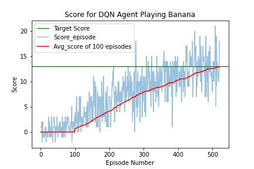

<center><h1>Udacity - DRLND</h1></center>
<center><h2>Project 1: Navigation</h2></center>
<center><h3>Report by Siddhant Tandon</h3></center>
<center><h4>Date: 18 May 2020</h4></center>

This is the first project report for the Udacity course Deep Reinforcement Learning. Details regarding the environment, algoritm and results can be found in this report.

### Environment
Navigation project uses the 'Banana app' made in Unity as its platform for evaluating learning algorithms. This environment, as described in [README](./README.md), contains a brain that executes the agent's actions. An overview of the environment:

- Continuous observation space
- Observation space size (per agent): 37
- One stacked vector of observations
- Episodic task with discrete action space
- Vector Action space size (per agent): 4

### Algorithm

To solve the Banana environment, a Deep Q-Network algorithm is used to learn the environment. Brief summary of the algorithm below:

1. Using Markov Decision Process principle, first sample environment and store experience tuples as **(s, a, r, s')**. These tuples are stored in `ReplayBuffer` with some size.
2. Next, a batch size (small and random) is selected from the experience buffer to train the network.
3. While training, target weights are fixed to help in learning.
4. Lastly, update set of weights using gradient descent.

### Overview of DQN

The DQN implemented uses three hidden layers with 600, 300 and 100 nodes (other configurations were used which gave worse results).
Hyperparameters chosen for the implementation are below:

```
Buffer_Size = int(5e4)  # replay buffer size
Batch_Size = 32         # minibatch size
Gamma = 0.99            # discount factor
TAU = 1e-3              # for soft update of target
# parameters
LR = 5e-4               # learning rate
UPDATE_EVERY = 4        # how often to update the network
SEED = 42
Episodes = 2000
MAX_TIMESTEPS = int(1e3)
hidden_layers = [600, 300, 100]
```

### Results

DQN algorithm was able to reach the environment's reward threshold in 421 episodes.

placeholder


<br>
The plot above shows the score with the average line (Red) per 100 episodes. It should be noted that the `LR` is influences the topology of the plot along with the `Gamma`. Changes in the above numbers for the same DQN can result in better or worse results.

### Ideas for Future Work

1. Modifying replay buffer to make the experience tuples prioritized: the higher the TD error the higher priority

2. Changing the Hyperparameters

2. Implementing a Double DQN - where you have two sets of weights to select action and evaluate it for better performance

3. Implementing a Dueling DQN (DDQN) - Introduce two separate estimators: one for the state value function and one for the state-dependent action advantage function (how much better is it to take this action vs other). The main benefit of this factoring is to generalize learning across actions without imposing any change to the underlying reinforcement learning algorithm.
