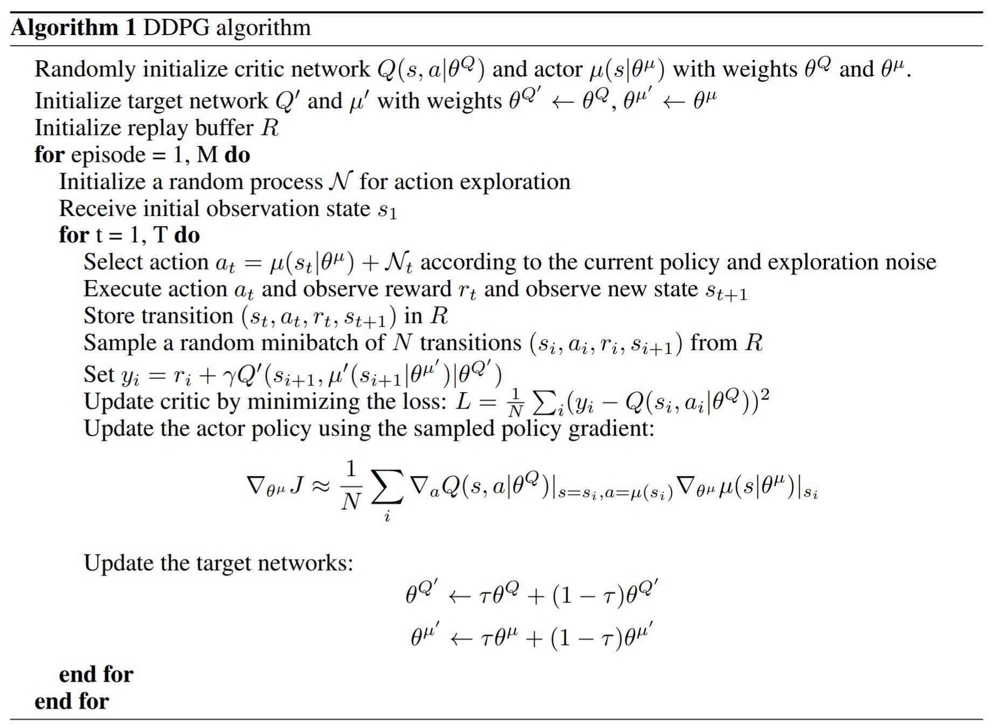
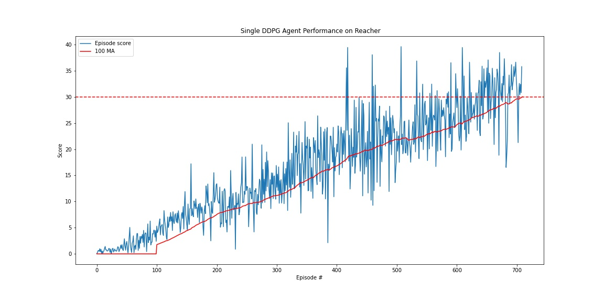

<center><h1>Udacity - DRLND</h1></center>
<center><h2>Project 2: Continuous Control</h2></center>
<center><h3>Report by Siddhant Tandon</h3></center>
<center><h4>Date: 20 June 2020</h4></center>


### Environment
The project uses an environment built in Unity called  [Reacher](https://github.com/Unity-Technologies/ml-agents/blob/master/docs/Learning-Environment-Examples.md#reacher). Whenever an agent reaches the goal location, the agent gets a reward of +0.1. The problem is deemed solved if the agent can maintain its position at the target locations for as many steps as possible. For this particular problem, the agent must achieve an average score of +30 over 100 consecutive episodes. The characteristics of the environment:

- Unity brain name: ReacherBrain
- Number of Visual Observations (per agent): 0
- Vector Observation space type: continuous
- Vector Observation space size (per agent): 33
- Number of stacked Vector Observation: 1
- Vector Action space type: continuous
- Vector Action space size (per agent): 4

### Learning Algorithm
DDPG is an Actor-Critic method that uses value function and direct policy approximation at the same time.
There are two internal types of neural networks:
- Actor network - transforms state to action values. In this environment there are 4 action values.
- Critic network - transforms state and action values to a quality measure of this state (Q(s, a))

Algorithm that was used in this work for solving the enviromnent is described in paper:
[CONTINUOUS CONTROL WITH DEEP REINFORCEMENT LEARNING](https://arxiv.org/pdf/1509.02971.pdf), Timothy P. Lillicrap et al.




DDPG is using both value function (Critic network) & policy approximation (Actor network) because using only one kind of approximation we get:

- policy based methods - have high variance
- value function methods - have high bias

Moreover, in contrast to DQN, a continuous action space can be used.

There are some similarities to the DQN architecture:

-  Experience Replay:<br>
  A buffer with experience tuples (s, a, r, s'): (state, action, reward, next_state)

-  Q-targets fixing: <br>
   2 neural networks (NN): local and target.
  Then fix target NN weights for some learning steps to decouple
  the local NN from target NN parameters making learning more stable and less likely to diverge or fall into oscillations.

Hence there are 4 neural networks:
- Critic target NN
- Critic local NN (for execution)
- Actor target NN
- Actor local NN (for execution)


### Overview of
The implementation is utilizing DDPG (Deep Deterministic Policy Gradients) with 2 hidden layers (300, 200 nodes) for both actor & critic networks.
Code is adapted from Udacity's [ddpg-pendulum](https://github.com/udacity/deep-reinforcement-learning/tree/master/ddpg-pendulum) repository.

Hyperparameters chosen for the implementation are below:

```python
SEED = 0                    # random seed for python, numpy & torch
episodes = 2000             # max episodes to run
max_t = 1000                # max steps in episode
solved_threshold = 30       # finish training when avg. score in 100 episodes crosses this threshold

batch_size = 128            # minibatch size
buffer_capacity = int(1e6)  # replay buffer size

learn_every_n = 20          # how many steps to collect experiences before learning
learn_updates = 10          # how many times to take samples from memory while learning
gamma = 0.99                # discount factor
tau = 1e-3                  # for soft update of target parameters
learning_rate = 1e-4        # learning rate for both actor & critic networks
max_norm = 1                # clipping of gradients to prevent gradient explosion
```


### Results
As shown below agent learned the environment fairly quickly. In ~ 350 episodes it reached average 13+ reward.


<br>
The weights of the networks are stored in `checkpoint_actor.pth` and `checkpoint_critic.pth` file using `torch.save(agent.local.state_dict(), 'checkpoint.pth')`

### Ideas for Future Work
 - <ins>Prioritized Experience Replay</ins>:<br>s
This approach comes from the idea that we want to focus our training on the actions that were "way off" what we did.
That means the higher the TD error the higher priority. We store in the experience buffer the probability of choosing the experience tuple depending on the TD error.
Then we sample the experiences based on this probability.
There is one caveat that it's required to add small epsilon to the probability (_p_) since setting the tuple's `p = 0` will make it practically disappear and the agent will never see that tuple again.

 - <ins>Trust Region Policy Optimization (TRPO) and Truncated Natural Policy Gradient (TNPG)</ins>:
<br>In the trust region, we determine the maximum step size that we want to explore for optimization and then we locate the optimal point within this trust region.
To control the learning speed better, we can be expanded or shrink this trust region in runtime according to the curvature of the surface.
This technique is used because traditional policy based & gradient optimization model for RL might make a too large step and actually fall down (in terms of rewards) and never recover again.

 - <ins>Other algorithms</ins>: <br>PPO, A3C, and D4PG that use multiple (non-interacting, parallel) copies of the same agent to distribute the task of gathering experience which can be advantageous for use in solveing the problem above.
